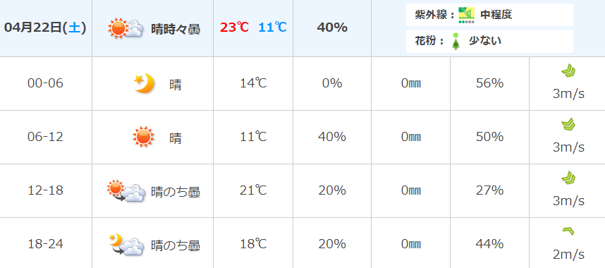

# 基本情報
## 山
- 山頂標高：628m
    - 登山口から山頂までの標高差：約470m
    - 上り下り標高差：約650m
- 路面主要構成：木の階段+舗装路
    - 泥道・岩基本ないので、**専門的な登山靴要らない**
- 登山口：猿投神社（愛知豊田市）
- まとめ（満点5点）
    - 難易度：★
    - 体力　：★★☆
    - 観光　：★★★★
- 地図

## 4/22の登山口天気(04/17時点の情報)

- 前日(4/21)雨なので、当日の道は少し濡れている可能性あり
    - 階段・舗装路がほどんとなので、濡れていても歩きやすいので、専門的な登山靴要らなくても大丈夫
    - 濡れていると靴汚れやすいので、汚れても大丈夫な靴がお勧め
- 11:00から登り始めると、登山気温予想は16~20℃
    - 山頂は標高より登山口より-3℃予想
    - 登り始めると体が熱くなり、止まって休憩取ると寒くなり(特に山頂)
        - **状況に応じて保温性能調節しやすいようなウエア組合わせがお勧め**
        - 当日風は強くないが風はまだ寒いので防風できるコードがお勧め

# スケージュール（交通機関）
- 9:45：豊田市駅西口マクドナルド（[豊田市駅前店](https://map.mcdonalds.co.jp/map/23037)）前に集合
- 10:00 ~ 10:30：豊田おいでんバス：「豊田市駅」～「猿投神社前駅」（**藤岡・豊田線**）
- ①10:30 ~ 12:30 or 13:00：東海自然歩道経由で休憩所・展望台まで登山
- ②**13:00 ~ 13:45：休憩、昼ご飯**
- ③13:45 ~ 14:45：東の登山道で三角点に登頂
- ④**14:45 ~ 15:00：山頂で観光、休憩**
- ⑤15:00 ~ 15:45：西の登山道経由で血洗いの滝まで下山
- ⑥15:45 ~ 16:15：下山しながら猿投七滝観光
- ⑦16:15 ~ 17:45：林道猿投山1号線経由で、「猿投神社前駅」バス駅まで下山
    - 18:00のバスに間に合わないと、次は19:20
- 18:00 ~ 18:28：豊田おいでんバス：「猿投神社前駅」～「豊田市駅」（**藤岡・豊田線**）
- 18:28 ~ ：豊田市駅周辺で夕食。そしてそれぞれ電車で帰る

# 当日の持ち物
- 昼ご飯（以下はお勧め）
    - コーンスープ・味噌汁（お湯必要）
    - 尾西食品　アルファ米（お湯お勧め）
        - 購入困難・大量購入したない場合に何の方から用意できる
- チョコレート・キットカット：エネルギー補充
- 1L以上のお水
    

# 車の場合（メリット）
- 出発時間と帰る時間はある程度自由
- バス待ち時間も要らない。間に合わない心配もなく。
- 車にものを置ける
- **下山後は[「猿投温泉」](https://sanageonsen.p-castle.co.jp/kinsenyu/)に行ける（日帰り）**
    - 交通機関の場合アクセス困難のため車のみ
    - **登山後の温泉は最高**
    - 場合によっては宿泊も可能